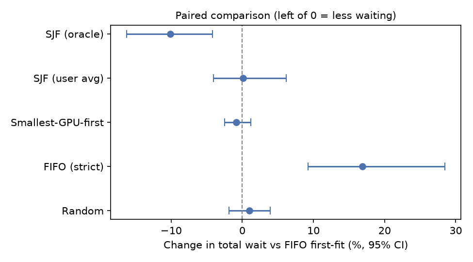

# Learning to Schedule Deep Learning Jobs on a GPU Cluster

Course project for *Understanding RL* (Fall 2026). **Phase 1:** a working
simulator of a GPU cluster, rule-based baseline schedulers, and their first
results. RL agents (DQN and PPO) come in Phase 2.

The design is our own, anchored on **RLScheduler** (Zhang et al., SC 2020):
the agent picks which waiting job runs next, the cluster is a pool of
resources, and the reward matches the metric being optimized. We apply it to
deep learning jobs from Microsoft's Philly trace.

## The problem

Jobs arrive at a shared GPU cluster. Each job needs a fixed number of GPUs, all
at the same time, and runs from seconds to days. Whenever GPUs free up, a
scheduler must decide **which waiting job starts next**. A bad order makes many
short jobs wait behind long ones. Job lengths are unknown when a job arrives;
the scheduler only has the user's past behaviour to go on.

## RL formulation

| Part | Definition |
|---|---|
| Environment | Event-driven simulator of one pool of `C` GPUs. Jobs arrive at their trace submit times, need all their GPUs at once (gang scheduling), and run for their trace duration. No preemption. |
| Decision point | Whenever at least one job in the visible window fits in the free GPUs. Time jumps between arrivals and completions. |
| State (52 numbers, all in [0, 1]) | For each of the first 10 queued jobs: slot filled, GPUs requested / C, fits now, log duration feature, log time waited. Plus free GPUs / C and log queue length. All use fixed scales, so they mean the same in 256- and 1,024-job episodes. |
| Duration feature | `estimate` = user's past average (realistic), `oracle` = true duration (upper reference), `none` = 0. |
| Action (Discrete(11)) | 0-9: start the job in that queue slot. 10: WAIT until the next arrival or completion. Invalid actions are masked (`env.action_masks()`, works with `sb3_contrib.MaskablePPO`). |
| Reward (`wait`, default) | Minus the waiting time accrued by all queued jobs since the last step (scaled). Over an episode it sums to minus the total waiting time. |
| Reward (`bsld`, alternative) | 0 until the end, then minus the episode's average bounded slowdown. |
| Episode | Consecutive jobs from the trace, until all have finished. **Training: 256 jobs. Testing: 1,024 jobs** (RLScheduler evaluated on 1,024-job sequences). |
| Episode start (`--warm-start`) | The cluster begins with the jobs that, per the trace, were still running when the episode's first job arrived. They hold their GPUs until they finish but are excluded from the metrics. Needed for Philly: in the main virtual cluster, jobs over 8 days use 62% of all GPU-time, so an empty start removes most of the real load. |
| Train / test | First 70% of the trace (by submit time) for training, last 30% for testing. |

**Main metric: average job completion time (JCT).** Run times never change in
this simulator, so average JCT = average wait + a constant; the two rank
policies identically and match the `wait` reward. We also report average wait,
median and 99th-percentile JCT, average bounded slowdown
`max((wait + run) / max(run, 10 s), 1)`, and GPU utilization. Results are
mean with 95% bootstrap confidence intervals and the interquartile mean (IQM)
across episodes (Agarwal et al., 2021). All policies run on the same job
sequences (paired comparison).

## Design decisions and their basis

| Decision | Choice | Basis |
|---|---|---|
| Action | Pick 1 of the first 10 queued jobs, or WAIT | Following RLScheduler / DeepRM (pick from a visible queue window) |
| Cluster model | One pool of GPUs | Following RLScheduler (jobs request a number of processors). Machine-level model is a Phase 2 experiment |
| Reward and metric | Waiting time / average JCT | RLScheduler trains on the metric it reports; RLTune reports wait, JCT, bounded slowdown and utilization |
| Episode length | Train 256, test 1,024 | RLScheduler tests on 1,024-job sequences; RLBackfilling trains on 256 and tests on 1,024 |
| Duration estimate | User's past average, past jobs only | Realistic: true durations are unknown at submission. History-based prediction as in Helios (Hu et al., SC 2021) |
| Workload | Philly trace, virtual cluster `6214e9` (51,955 jobs); `11cb48` for a cross-cluster test; retries merged into one job; 60-day jobs kept | Real DL training jobs (Jeon et al., ATC 2019); largest cluster has the most data |
| Cluster size | 256 GPUs with warm start | Fewest skipped background jobs of the sizes tried, plausible waits (~5-7 h), and job order still matters (true durations cut wait ~10%) |
| Baselines | Random, FIFO, FIFO first-fit, smallest-GPU-first, SJF (user avg), SJF (true duration) | On Philly all realistic rules tie with first-fit, so first-fit is the reference; SJF with true durations is a reference point, not a ceiling |

## Quick start

```bash
pip install -r requirements.txt
python -m pytest -q                          # 12 hand-checked tests
python scripts/check_env.py                  # Gymnasium API check + speed
python scripts/run_baselines.py --data synthetic
```

`run_baselines.py` writes `per_episode.csv`, `summary.csv`, `summary.md`,
`config.json`, `baselines_jct.png` and `jct_cdf.png` to `results/baselines_<data>/`,
plus a **paired comparison** against a reference rule (`--reference`, default
first-fit): `paired.csv`, `paired.md` and `paired_vs_reference.png`. Because all
policies run the same episodes, the paired comparison (per-episode differences,
resampled together) is the right test of whether one rule beats another.
`--non-overlapping` uses back-to-back test episodes that share no jobs, so
episodes are closer to independent (fewer episodes, wider but more honest CIs).

## Using the real Philly trace

The trace (about 1 GB compressed) is stored with Git LFS in
[msr-fiddle/philly-traces](https://github.com/msr-fiddle/philly-traces).

```bash
git lfs install
git clone https://github.com/msr-fiddle/philly-traces.git
tar -xzf philly-traces/trace-data.tar.gz -C philly-traces
# point --job-log at the extracted cluster_job_log file
python scripts/prepare_philly.py --job-log philly-traces/trace-data/cluster_job_log
python scripts/check_env.py --jobs-csv data/philly_jobs.csv --capacity 64
# main result: 15 back-to-back test episodes that share no jobs
python scripts/run_baselines.py --data philly --vc 6214e9 --capacity 256 --warm-start --non-overlapping --out results/philly_6214e9_c256_warm_nonoverlap
# robustness check: 30 randomly placed (overlapping) test episodes
python scripts/run_baselines.py --data philly --vc 6214e9 --capacity 256 --warm-start --out results/philly_6214e9_c256_warm
```

`prepare_philly.py` prints the workload statistics needed for the report:
job counts, drops, duration percentiles, GPU request shares, and how far the
user-average estimate is from the true duration. Cluster size (`--load` or
`--capacity`) and virtual cluster (`--vc`) are chosen after looking at these
numbers.

## Baselines

All baselines see only the same 10-job window as the agent.

| Name | Rule |
|---|---|
| `random` | Random job among those that fit |
| `fifo` | Strict first-in-first-out: if the oldest job does not fit, wait |
| `fifo_ff` | First-fit: the oldest job that fits now |
| `sgf` | Smallest GPU request first |
| `sjf` | Shortest job first using the user's past average (realistic) |
| `sjf_oracle` | Shortest job first using the true duration (not possible in practice) |

## Philly workload (from `prepare_philly.py`)

* 111,798 usable jobs (of 117,325) from 319 users in 15 virtual clusters, over 136.9 days.
  Dropped: 5,236 with no attempts, 194 still running, 42 with no valid attempt, 55 with zero GPUs.
* Job length: 25% finish within 1.9 min, median 20 min, 90th percentile 8.7 h,
  99th percentile 7.6 days, longest about 60 days. 1,067 jobs (about 1%) run longer than 8 days.
* The longest jobs are 1-GPU jobs killed at almost exactly 60 days (possibly a time limit).
* 86.6% of jobs use 1 GPU. Status: 74% passed, 16% failed, 10% killed.
  Median length: failed 10 min, passed 19 min, killed 70 min.
* The user's past average is a poor predictor: median error is a factor of about 3.
* Main virtual cluster `6214e9`: jobs over 8 days use 62% of its GPU-time. At 256 GPUs its
  training period's offered load is 1.07 but its test period's is 0.41, because the longest
  jobs were submitted early.

## Phase 1 preliminary results (Philly, virtual cluster `6214e9`, 256 GPUs, warm start)

**Main result: 15 non-overlapping test episodes x 1,024 jobs** (every test job counted once).
Paired comparison against FIFO first-fit (negative = less waiting):

| Policy | Wait difference (h): mean [95% CI] | Change in total wait: % [95% CI] | Episodes with less wait | Clear difference? |
|---|---|---|---|---|
| Random | +0.07 [-0.09, +0.31] | +1.0% [-1.9, +4.0] | 53% | no |
| FIFO (strict) | +1.18 [+0.48, +2.02] | +16.8% [+9.2, +28.5] | 0% | yes (worse) |
| Smallest-GPU-first | -0.06 [-0.22, +0.06] | -0.9% [-2.5, +1.2] | 33% | no |
| SJF (user avg) | +0.01 [-0.29, +0.45] | +0.1% [-4.0, +6.2] | 53% | no |
| SJF (true duration) | -0.71 [-1.43, -0.20] | -10.1% [-16.2, -4.2] | 87% | yes (better) |

Absolute values (same 15 episodes): first-fit average wait 6.99 h, average JCT 11.00 h,
GPU utilization 0.47; SJF with true durations 6.28 h and 10.29 h.

**Robustness check: 30 randomly placed (overlapping) episodes.** Same pattern: realistic
rules tie with first-fit, strict FIFO is worse (+46.8% [+21.1, +78.0]), true durations are
better (-17.3% [-27.8, -8.6]).

Initial observations:

1. **Starting episodes with an empty cluster removes the real load.** Without warm start,
   every rule tied at every cluster size tried, with GPU utilization of 8-13%.
2. **All realistic rules tie with first-fit.** Random, smallest-GPU-first and SJF with the
   user's past average are not distinguishable from first-fit (paired CIs include 0).
3. **Realistic duration estimates do not help, but true durations would.** SJF with the
   user's past average gains nothing (estimates are off by a factor of about 3); SJF with
   true durations cuts total wait by about 10%. This gap is what an RL agent could try to
   recover from other signals (GPU request, user history, time waited, WAIT).
4. **Strict FIFO is the worst rule** (+17% total wait).
5. **Overlapping episodes distort results.** SJF with user averages looked 18% worse than
   first-fit with overlapping episodes but tied with non-overlapping ones, so the
   non-overlapping set is the main result.
6. **Change to a pre-set criterion.** Before seeing Philly results we required SJF with user
   averages to beat first-fit by 10% or more, so that job order clearly matters. That
   assumption (useful estimates) held on synthetic data but not on Philly. We restated it
   as "SJF with true durations beats first-fit by 10% or more"; this holds only narrowly
   (10.1%, CI 4.2-16.2%).



Synthetic-data runs (pipeline check only, not used as results) are in `results/baselines_synthetic/`.

## Evaluation plan and success criteria (Phase 2)

* **Research questions:** (RQ1) Can an RL agent that does not know true run times reduce
  waiting time compared with first-fit? (RQ2) How much does it depend on duration
  information? (RQ3) Do the conclusions hold with 8-GPU machines and on another
  virtual cluster?
* **Algorithms:** DQN (own implementation, invalid actions excluded from action selection
  and targets) and MaskablePPO, trained on 256-job episodes from the training period,
  tested on 1,024-job episodes from the test period. Discount factor close to 1.
* **Tuning:** hyperparameters (including the discount factor) are tuned on a validation
  slice, the last 15% of the training period; never on the test period.
* **Seeds:** 10 per algorithm for the main comparison; 5 per algorithm for each experiment.
* **Success criterion:** for each seed, compute the change in total waiting time vs
  first-fit over the 15 non-overlapping test episodes (256 GPUs, warm start). The RL agent
  succeeds if the interquartile mean of this change across seeds has a 95% bootstrap CI
  (resampling seeds and episodes) lying entirely below zero. The 30 overlapping episodes
  are reported as a robustness check. We also report how much of the gap to SJF
  with true durations is recovered.
* **If RL does not meet the criterion,** we report where and why, using the duration
  information experiment (true / user average / none).

## Modeling assumptions and limitations

* **One pool of GPUs; no machine placement or locality.** Real clusters place
  multi-GPU jobs on specific servers, and Jeon et al. (2019) show locality
  affects both queueing and utilization. A machine-level model is planned as a
  Phase 2 experiment.
* **Retries are folded into one job** (duration = sum of attempt run times).
  Killed and failed jobs are kept because they used GPUs.
* **No preemption, no job failures** during simulation.
* **Window of 10.** Neither the agent nor the baselines can start a job beyond
  the first 10 in the queue.
* **Cluster size is chosen by offered load** (`--load`), because the trace does
  not record each virtual cluster's GPU quota.
* **Warm start is an approximation.** Background jobs are assumed to have
  started at their submit time (the trace does not give their real waits). If
  they need more GPUs than the cluster has, they are added in submission order
  until it is full and the rest are skipped (count reported in `config.json`;
  about 130 per episode at 256 GPUs), so load is underestimated.
* **The simulator has not yet been checked against the waits recorded in the
  trace.** This validation is planned for Phase 2.
  Without `--warm-start`, episodes start with an empty cluster.
* **Utilization** is measured from the GPUs actually busy over the episode,
  including background jobs.
* **Training and test periods differ in load.** For the main virtual cluster
  (`6214e9`) at 256 GPUs, the training period's offered load is 1.07 and the
  test period's is 0.41, because the longest jobs were submitted early.
* **Duration estimates use the trace's real history** (jobs that finished
  before submission, per the trace), not the simulator's own finish times.
* Jobs needing more GPUs than the cluster has are dropped (count reported in
  `config.json`).

## Repository structure

```
gpusched/
  data.py        Philly parser, synthetic jobs, duration estimates, splits, cluster sizing
  env.py         GPUSchedEnv (Gymnasium environment)
  baselines.py   Rule-based policies and run_episode()
  metrics.py     Episode metrics, IQM, bootstrap confidence intervals
scripts/
  prepare_philly.py  Parse cluster_job_log -> data/philly_jobs.csv (+ workload stats)
  check_env.py       Gymnasium API check and speed test
  run_baselines.py   Evaluate baselines; write tables and figures
  smoke_maskable_ppo.py  Quick check that MaskablePPO trains on the env (not a result)
tests/
  test_env.py        12 hand-computed tests: schedules, rewards, warm start, paired stats, parser, estimates, observation scaling
results/             Outputs (Philly results + synthetic pipeline check)
data/                Local data (not committed)
```

## Roadmap (Phase 2)

* DQN (own implementation) and MaskablePPO (sb3-contrib), trained on 256-job
  episodes and tested on 1,024-job episodes; `pip install -r requirements-rl.txt`.
* Core experiments: **E1** duration information (true / user average / none);
  **E2** one GPU pool vs 8-GPU machines; **E3** train on `6214e9`, test on `11cb48`.
* If time permits: episode-end bounded-slowdown reward, window size 5 vs 20, no WAIT
  action, and an agent that picks a rule instead of a job.
* Check simulated waits against the waits recorded in the trace.
* Milestones: by Oct 19 DQN implemented and tested, PPO learning curves; by Nov 2 main
  comparison and tuning; by Nov 13 E1-E3; presentation Nov 17-Dec 1; final paper Dec 8.

## References

* M. Jeon et al., "Analysis of Large-Scale Multi-Tenant GPU Clusters for DNN Training Workloads," USENIX ATC 2019.
* Q. Hu et al., "Characterization and Prediction of Deep Learning Workloads in Large-Scale GPU Datacenters," SC 2021.
* H. Mao et al., "Resource Management with Deep Reinforcement Learning," HotNets 2016.
* H. Mao et al., "Learning Scheduling Algorithms for Data Processing Clusters," SIGCOMM 2019.
* D. Zhang et al., "RLScheduler: An Automated HPC Batch Job Scheduler Using Reinforcement Learning," SC 2020.
* Y. Peng et al., "DL2: A Deep Learning-driven Scheduler for Deep Learning Clusters," arXiv:1909.06040.
* S. Dongare et al., "Hybrid Learning and Optimization-Based Dynamic Scheduling for DL Workloads on Heterogeneous GPU Clusters (RLTune)," arXiv:2512.10271, 2025.
* R. Agarwal et al., "Deep Reinforcement Learning at the Edge of the Statistical Precipice," NeurIPS 2021.
* S. Huang and S. Ontañón, "A Closer Look at Invalid Action Masking in Policy Gradient Algorithms," FLAIRS 2022.
